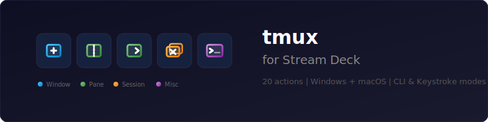
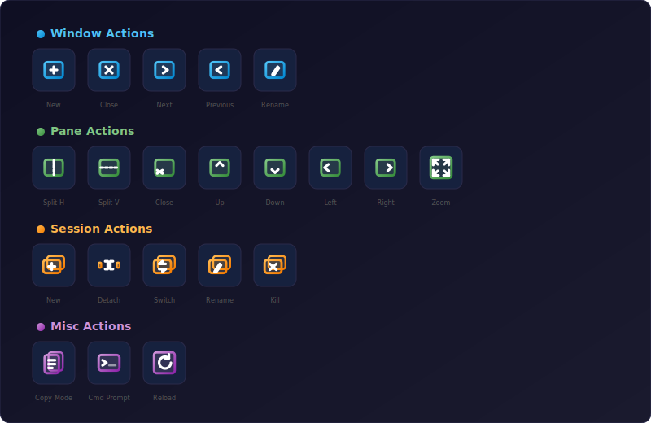

# tmux for Stream Deck

<p align="center">
  
</p>

<p align="center">
  <strong>Control tmux sessions, windows, and panes from your Stream Deck.</strong><br/>
  21 actions &bull; Windows + macOS &bull; CLI &amp; Keystroke modes
</p>

<p align="center">
  
  
  
  
</p>

---

## Actions

<p align="center">
  
</p>

| Category | Actions | Color |
|----------|---------|-------|
| **Window** | New, Close, Next, Previous, Rename | Blue |
| **Pane** | Split H, Split V, Close, Up, Down, Left, Right, Toggle Zoom | Green |
| **Session** | New, Detach, Switch, Rename, Kill | Orange |
| **Misc** | Copy Mode, Command Prompt, Reload Config | Purple |

Each action supports two execution modes:

- **CLI Command** (default) -- runs `tmux <command>` directly via shell. Most reliable.
- **Keystroke Simulation** -- sends the tmux prefix key + shortcut to the focused terminal window. Useful when CLI access isn't available.

## Quick Start

### Prerequisites

- [Stream Deck](https://www.elgato.com/stream-deck) hardware + Stream Deck app (v6.9+)
- [Node.js 20](https://nodejs.org/) or later
- [tmux](https://github.com/tmux/tmux) installed and on your PATH (or [psmux](https://github.com/nickvdyck/psmux) on Windows)

### Install

```bash
git clone https://github.com/tarikguney/tmux-streamdeck.git
cd tmux-streamdeck
npm install
npm run build
```

### Link to Stream Deck

```bash
npx @elgato/cli link com.tarikguney.tmux.sdPlugin
```

Restart the Stream Deck app, then find **tmux Shortcuts** in the action list.

### Package for Distribution

```bash
npx @elgato/cli pack com.tarikguney.tmux.sdPlugin
```

This creates a `.streamDeckPlugin` file that can be double-clicked to install.

## Configuration

Each button has a **Property Inspector** panel with these settings:

| Setting | Description |
|---------|-------------|
| **Multiplexer** | `tmux` (macOS/Linux) or `psmux` (Windows). Auto-detected by OS. |
| **Command Method** | CLI Command or Keystroke Simulation. |
| **Custom Command** | Override the default tmux command for this button. |
| **Executable Path** | Full path to tmux/psmux if not on PATH. |
| **Socket Path** | For advanced multi-server tmux setups. |
| **Target Session** | Specify which session to send commands to. |
| **Use WSL** | Prefix commands with `wsl` for Windows Subsystem for Linux. |
| **Prefix Key** | Tmux prefix for keystroke mode (default: `ctrl+b`). |

## Platform Notes

### macOS
Keystroke simulation uses AppleScript. You may need to grant **Accessibility** permissions to the Stream Deck app under System Settings > Privacy & Security > Accessibility.

### Windows
- Keystroke simulation uses PowerShell `SendKeys` -- the terminal must be the foreground window.
- If your terminal runs as Administrator, Stream Deck must also run as Administrator.
- For tmux via WSL, enable the **Use WSL** checkbox in the Property Inspector.

## Development

```bash
npm run watch     # rebuild on file changes
```

After each rebuild, restart the plugin:

```bash
npx @elgato/cli restart com.tarikguney.tmux
```

### Project Structure

```
src/
  actions/
    tmux-action.ts          # Base class -- onKeyDown logic, settings handling
    window-actions.ts       # 5 window actions
    pane-actions.ts         # 8 pane actions
    session-actions.ts      # 5 session actions
    misc-actions.ts         # 3 misc actions
  executors/
    cli-executor.ts         # Runs tmux commands via child_process
    keystroke-executor.ts   # Dispatches to platform-specific keystroke sender
  platform/
    platform.ts             # OS detection helpers
    macos-keys.ts           # AppleScript keystroke simulation
    windows-keys.ts         # PowerShell SendKeys simulation
  plugin.ts                 # Entry point -- registers all actions
  types.ts                  # TypeScript type definitions

com.tarikguney.tmux.sdPlugin/
  manifest.json             # Plugin manifest (all 21 actions defined here)
  ui/tmux-action.html       # Shared Property Inspector UI
  imgs/                     # Color-coded SVG icons by category
  bin/plugin.js             # Compiled output (built by Rollup)
```

## Logs

| Platform | Log Location |
|----------|-------------|
| macOS | `~/Library/Logs/ElgatoStreamDeck/com.tarikguney.tmux` |
| Windows | `%APPDATA%\Elgato\StreamDeck\logs\com.tarikguney.tmux` |

Debug mode is disabled by default in `manifest.json`. To enable it, set `"Debug": "enabled"` and attach a Node.js debugger to inspect the plugin process.

## License

MIT
